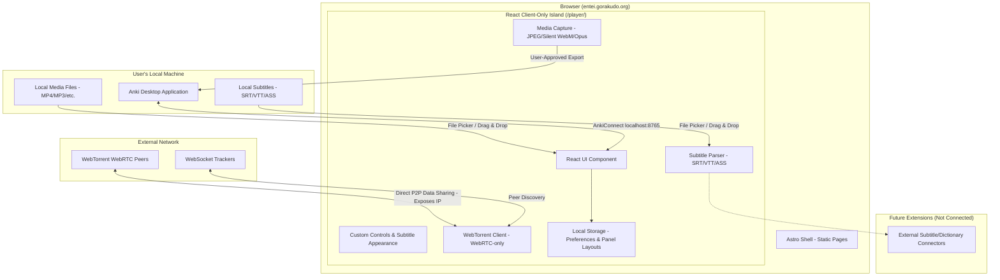

# Entei

Entei is an open-source, static, and local-first media player designed for Japanese language learning. It is built with **Astro + React** for GitHub Pages / [entei.gorakudo.org](https://entei.gorakudo.org) (deployment is currently pending; the site is not yet live).

Entei has **no server-side application backend**. Everything runs entirely inside your web browser.

---

## How It Works

Entei runs local media files and subtitles in your web browser. Your user data, media captures, and learning settings stay completely local on your machine.

_Note: While your data stays on your machine, Entei is not strictly offline-only. The optional WebTorrent feature connects to external WebRTC peers, which involves standard network communication._

For details on the project phases, see the [PLAYER_PHASES.md](./docs/PLAYER_PHASES.md) design document.

---

## Features

Here is what is currently implemented in Entei:

### 1. Local Media & Custom Playback Controls

- **Media Formats:** Plays local video and audio formats supported natively by your browser.
- **Custom Control Bar:** Custom HTML5 controls including play/pause, timeline seek, volume/mute slider, and fullscreen.
- **Layout Controls:** Resizable split panels to adjust the video and subtitle sidebar sizes on desktop.

### 2. Subtitles & Overlay

- **Formats:** Parses SRT, VTT, and ASS subtitles. Dialogue timing and plain selectable text are extracted using `ass-compiler`, while ASS override/visual styling tags are stripped.
- **Yomitan Integration:** Renders text-selectable subtitle lines directly on top of the media, allowing you to scan words using browser extensions like Yomitan.
- **Subtitle Sidebar:** A scrollable list of all subtitle cues for quick reference and navigation. Clicking any line seeks the video to that exact timestamp.
- **Style Preferences:** A subtitle settings panel where you can adjust font size (16–48px), text color, background color, background opacity (0–100%), padding (0–32px), and vertical offset (0–200px) with instant live preview.

### 3. Playback Modes for Learning

Entei includes smart playback modes to speed up your learning:

- **Normal:** Plays the media at your selected speed.
- **Condensed:** Automatically skips silent gaps between subtitles that are longer than 1000 milliseconds.
- **Fast-Forward:** Plays at 1x speed during subtitle lines (plus a 600ms boundary), and speeds up to 3x during silent gaps.

### 4. Local Mining & Anki Export

You can capture material from your media and export it to your flashcards:

- **Pickaxe Mine Button:** Clicking the mine button pauses playback and captures the current subtitle range.
- **Mining Preview:** A dialog that lets you adjust the start/end times (with 0.1-second precision) and automatically updates the media artifacts.
- **Browser-Native Capture:** Generates JPEG screenshots, silent WebM video clips (automatically selecting VP8/VP9/AV1 based on browser support, with a 45-second limit), and Opus audio clips on the fly.
- **AnkiConnect Export:** Exports cards directly to your local desktop Anki app (communicating via loopback on port 8765). Supports creating new notes, updating the last added card, or appending scenes to existing cards via an inline search table.
- **DenChou Note Type Support:** If you select the `DenChou` note type, Entei automatically wraps the sentence and source fields in `<span class="group">...</span>` tags to keep layouts clean and prevent double-spacing.

For more details on mining and Anki integration, check out the [ANKI_MINER.md](./docs/ANKI_MINER.md) and [VIDEO_CLIP.md](./docs/VIDEO_CLIP.md) specs.

### 5. WebTorrent Streaming (Optional)

- **P2P Playback:** Stream video and audio directly in the browser by pasting a magnet URI.
- **Connection Gate:** Requires at least one active WebRTC peer to start. Entei uses a 30-second peer search timer before falling back.

Read more in the [WEBTORRENT_STREAMING.md](./docs/WEBTORRENT_STREAMING.md) specification.

---

## Privacy & Data Safety

Entei is designed around user privacy:

- **No Server Storage:** We do not host server-side proxies, cache servers, or search indexes. Your media files are never uploaded to any remote server.
- **Local Anki Connect:** Card creation requests are sent directly to `localhost:8765` on your own machine. Your API keys are kept in session memory and are never saved to local storage, URLs, or external logs.
- **WebTorrent Network Exposure:** When streaming via WebTorrent, you join a public peer-to-peer network. This means your public IP address will be visible to WebSocket trackers and WebRTC peers.
- **No External Partnerships:** Integration with external tools or platforms like Nadeshiko is not implemented, and no partnerships exist.

---

## System Architecture

The diagram below shows how Entei isolates features locally and communicates with local or peer-to-peer systems:



---

## Local Development

Entei is a static site built using Astro. You can run and test it locally using the following commands:

### Setup

Install all project dependencies from the repository root:

```bash
npm install
```

### Development

Start the local development server (defaults to `http://localhost:4321`):

```bash
npm run dev
```

### Production Build & Preview

Build the static website files to `apps/web/dist`:

```bash
npm run build
```

Preview the production build locally:

```bash
npm run preview
```

### Verification & Testing

Before submitting changes, run these verification checks:

```bash
# Check code formatting (Prettier)
npm run format:check

# Run TypeScript and Astro type checks
npm run check

# Run Vitest unit and integration tests
npm run test
```

You can automatically format your files with Prettier by running:

```bash
npm run format
```

---

## Project Status & Roadmap

Entei is currently in the **Testing & Refinement** phase. The core features for the local-first player, playback modes, and Anki mining (Phases 0, 1, and 2) are code-complete and awaiting final manual browser QA.

### What is Deferred or Out of Scope

- **Deferred Subtitle Formats (P1.3b / P1.4):** Support for image-based subtitles (like PGS/SUP) and platform-specific XML subtitles are deferred. PGS image cues are not text-selectable or scannable by dictionary extensions like Yomitan, so they are not prioritized.
- **Streaming-Site Integration:** Direct integration with subscription streaming sites (like Netflix or YouTube overlays) is permanently out of scope. Entei does not use browser extensions or request browser permissions to inject UI overlay elements into third-party sites.

---

## EizouDendenshi Companion — Delivery Status

[EizouDendenshi (映像電伝師)](./companion/eizoudendenshi/README.md) is Entei's
planned loopback-only Windows / Termux companion. It will hand user-entered
YouTube and magnet sources to the player without server involvement; that
source integration remains in later ED-3 / ED-4 stages. See
[docs/EIZOU_DENDENSHI.md](./docs/EIZOU_DENDENSHI.md) for the full plan.

**Delivery is not complete.**

- ED-2D Stage A tooling (release helper, Termux bootstrap template,
  automated release test harness) is implemented; the harness is green
  (66/66), including release-identity checks (startup banner reports the
  requested release version and agrees with the manifest; plain `build`
  keeps the dev default).
- **ED-2D Stage B (clean-Termux device gate) PASSED on 2026-07-31** with
  the GitHub prerelease `eizoudendenshi-v0.2.0-rc.2`: on a fresh Termux
  reinstall the bootstrap downloaded from the GitHub release; the
  manifest Minisign verify, the `android/arm64` binary Minisign verify,
  and the SHA-256 check against the signed manifest all passed; the
  verified core installed into Termux app-private storage and launched in
  the foreground, emitting the pairing code. Installed bytes (6291752) and
  SHA-256
  (`d4cf15b544cffbaf60b1f1a35b8d0751436ef6456edca3a31e921fd9f15046b7`)
  matched the GitHub asset digest, with no bootstrap temp dirs left
  behind.
- The earlier **rc.1** (`eizoudendenshi-v0.2.0-rc.1`) Termux clean-install
  failed because the bootstrap's `curl -fsS` fetch did not follow the
  GitHub Release asset `302` redirects, so Minisign verification failed
  before install (fail-closed ordering worked). The rc.2 fetch fixes it
  (`--location`, bounded `--max-redirs`, HTTPS-only redirect targets), and
  the test harness statically enforces this so the regression cannot
  return. **rc.1 itself did not pass.**
- **Release-identity display fix — verified on device with `rc.3`
  (2026-07-31):** the rc.2 release showed `0.2.0-rc.2` in the manifest but
  `EizouDendenshi ED-2B (0.2.0)` in the binary banner — a display
  consistency bug (it did not invalidate the signature / install /
  pairing gate). `scripts/release.ps1` now injects the validated
  `-Version` into both release binaries at link time, and Go + harness
  tests pin the contract. The `eizoudendenshi-v0.2.0-rc.3` bootstrap
  passed the manifest Minisign verify, core Minisign verify, signed
  SHA-256 check, and app-private install on Termux; the foreground banner
  showed `EizouDendenshi ED-2B (0.2.0-rc.3)` on `http://127.0.0.1:36441`,
  matching the manifest version. The rc.2 identity display mismatch is
  closed.
- **ED-2C growing-media browser measurement — Windows headless Chrome MEASURED
  (2026-07-31):** against the real companion and a valid 4s H.264/AAC
  faststart MP4 (161958 bytes total, 124479 initially available = 77%),
  Windows headless Chrome 151 issued one `Range: bytes=0-` request, got
  `503` + `Retry-After: 1`, failed with media `error` code 4 and did
  **not** auto-retry (no recovery after the file completed either); an
  explicit `video.load()` + `play()` then got `206` and played to the end,
  and a post-reload seek worked. Android Chrome growing playback and the
  production bridge are **not** measured/implemented. Full record in
  [docs/EIZOU_DENDENSHI.md](./docs/EIZOU_DENDENSHI.md).
- **Delivery is still not complete:** HTTPS deployed Entei origin, Android
  Chrome growing-media progressive playback, audio listening/decode, and
  the Windows installer remain. The production bridge is unimplemented and
  cannot rely on Chrome auto-retry (it needs buffering + availability-based
  retry/backoff + an explicit `src`/`load()` reset once playable).

## Lineage & Inspiration

Entei's local playback modes and media extraction capabilities are inspired by the standalone local-media features of [asbplayer](https://github.com/giahung2201/asbplayer) (MIT License). While Entei borrows logic patterns for precise subtitle timing and range capture, it operates independently of asbplayer, features no shared package dependencies, and implements a completely custom React and shadcn/ui interface.

---

## License

This project is licensed under the [Mozilla Public License 2.0 (MPL-2.0)](./LICENSE).
