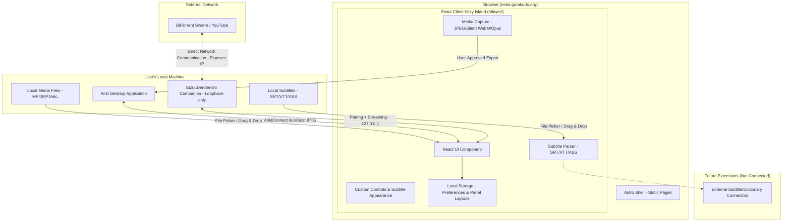

# Entei

Entei is an open-source, static, and local-first media player designed for Japanese language learning. It is built with **Astro + React** and deployed to GitHub Pages / [entei.gorakudo.org](https://entei.gorakudo.org) (live since 2026-08-12; main-branch pushes auto-deploy via GitHub Actions).

Entei has **no server-side application backend**. Everything runs entirely inside your web browser.

---

## How It Works

Entei runs local media files and subtitles in your web browser. Your user data, media captures, and learning settings stay completely local on your machine.

_Note: While your data stays on your machine, Entei is not strictly offline-only. When you stream a magnet or YouTube source through the optional EizouDendenshi companion, it connects to external BitTorrent swarms or YouTube, which involves standard network communication._

For details on the project phases, see the [PLAYER_PHASES.md](./docs/PLAYER_PHASES.md) design document.

---

## Features

Here is what is currently implemented in Entei:

### 1. Local Media & Custom Playback Controls

- **Media Formats:** Plays local video and audio formats supported natively by your browser.
- **Custom Control Bar:** Custom HTML5 controls including play/pause, timeline seek, volume/mute slider, and fullscreen.
- **Layout Controls:** Resizable split panels to adjust the video and subtitle sidebar sizes on desktop.

### 2. Subtitles & Overlay

- **Formats:** Parses SRT, VTT, and ASS subtitles. Dialogue timing and plain selectable text are extracted using `ass-compiler`, while ASS override/visual styling tags are stripped.
- **Yomitan Integration:** Renders text-selectable subtitle lines directly on top of the media, allowing you to scan words using browser extensions like Yomitan.
- **Subtitle Sidebar:** A scrollable list of all subtitle cues for quick reference and navigation. Clicking any line seeks the video to that exact timestamp.
- **Style Preferences:** A subtitle settings panel where you can adjust font size (16–48px), text color, background color, background opacity (0–100%), padding (0–32px), and vertical offset (0–200px) with instant live preview.

### 3. Playback Modes for Learning

Entei includes smart playback modes to speed up your learning:

- **Normal:** Plays the media at your selected speed.
- **Condensed:** Automatically skips silent gaps between subtitles that are longer than 1000 milliseconds.
- **Fast-Forward:** Plays at 1x speed during subtitle lines (plus a 600ms boundary), and speeds up to 3x during silent gaps.

### 4. Local Mining & Anki Export

You can capture material from your media and export it to your flashcards:

- **Pickaxe Mine Button:** Clicking the mine button pauses playback and captures the current subtitle range.
- **Mining Preview:** A dialog that lets you adjust the start/end times (with 0.1-second precision) and automatically updates the media artifacts.
- **Browser-Native Capture:** Generates JPEG screenshots, silent WebM video clips (automatically selecting VP8/VP9/AV1 based on browser support, with a 45-second limit), and Opus audio clips on the fly.
- **AnkiConnect Export:** Exports cards directly to your local desktop Anki app (communicating via loopback on port 8765). Supports creating new notes, updating the last added card, or appending scenes to existing cards via an inline search table.
- **DenChou Note Type Support:** If you select the `DenChou` note type, Entei automatically wraps the sentence and source fields in `<span class="group">...</span>` tags to keep layouts clean and prevent double-spacing.

For more details on mining and Anki integration, check out the [ANKI_MINER.md](./docs/ANKI_MINER.md) and [VIDEO_CLIP.md](./docs/VIDEO_CLIP.md) specs.

The [THANKS_TO_MEMBERS.md](./docs/THANKS_TO_MEMBERS.md) spec describes the
"Thanks To" section that shows active YouTube channel members
(name, avatar, level). Implemented since 2026-08-12: data is currently
imported weekly from a YouTube Studio member CSV export
(`members-supporter/import-csv.mjs`), with an automatic `members.list`
fetch pipeline (`members-supporter/fetch-members.mjs`) ready once YouTube
grants API access.

### 5. Magnet / YouTube Streaming (Optional, via EizouDendenshi)

- **Magnet Streaming:** Stream BitTorrent magnet links through the optional EizouDendenshi local companion (loopback-only `127.0.0.1`) using a regular BitTorrent client — no in-browser WebTorrent.
- **YouTube Streaming:** Stream YouTube videos (up to 1080p) through the same companion.
- **Pairing Gate:** Sources require pairing with the local companion before streaming starts.

Read more in the [EIZOU_DENDENSHI.md](./docs/EIZOU_DENDENSHI.md) specification.

---

## Privacy & Data Safety

Entei is designed around user privacy:

- **No Server Storage:** We do not host server-side proxies, cache servers, or search indexes. Your media files are never uploaded to any remote server.
- **Local Anki Connect:** Card creation requests are sent directly to `localhost:8765` on your own machine. Your API keys are kept in session memory and are never saved to local storage, URLs, or external logs.
- **Companion Network Exposure:** When streaming a magnet or YouTube source via the EizouDendenshi companion, the companion (not the browser) connects to public BitTorrent swarms or YouTube, so your public IP address is visible to swarm peers/trackers or YouTube.
- **Client-Side External Integrations (BYOK):** Any optional third-party integrations (such as the Nadeshiko search API) connect directly from your browser using your own API key. Entei operates no backend proxy and never receives, logs, or stores your API keys or search data on remote servers.

---

## System Architecture

The diagram below shows how Entei isolates features locally and communicates with local or peer-to-peer systems:



---

## Local Development

Entei is a static site built using Astro. You can run and test it locally using the following commands:

### Setup

Install all project dependencies from the repository root:

```bash
npm install
```

### Development

Start the local development server (defaults to `http://localhost:4321`):

```bash
npm run dev
```

### Production Build & Preview

Build the static website files to `apps/web/dist`:

```bash
npm run build
```

Preview the production build locally:

```bash
npm run preview
```

### Verification & Testing

Before submitting changes, run these verification checks:

```bash
# Check code formatting (Prettier)
npm run format:check

# Run TypeScript and Astro type checks
npm run check

# Run Vitest unit and integration tests
npm run test
```

You can automatically format your files with Prettier by running:

```bash
npm run format
```

---

## Project Status & Roadmap

Entei is currently in the **Testing & Refinement** phase. The local-first player, playback modes, and Anki mining (Phases 0, 1, and 2), plus the immersion Tracker (P6 foundation + `/tracker/` dashboard), are implemented and live on [entei.gorakudo.org](https://entei.gorakudo.org) since 2026-08-12. Subtitle timing auto-sync (subomatic WASM) is merged to main; remaining work is manual browser QA and the final EizouDendenshi companion gates.

### What is Deferred or Out of Scope

- **Deferred Subtitle Formats (P1.3b / P1.4):** Support for image-based subtitles (like PGS/SUP) and platform-specific XML subtitles are deferred. PGS image cues are not text-selectable or scannable by dictionary extensions like Yomitan, so they are not prioritized.
- **Streaming-Site Integration:** Direct integration with subscription streaming sites (like Netflix or YouTube overlays) is permanently out of scope. Entei does not use browser extensions or request browser permissions to inject UI overlay elements into third-party sites.

---

## EizouDendenshi Companion — Delivery Status

[EizouDendenshi (映像電伝師)](./companion/eizoudendenshi/README.md) is Entei's
loopback-only Windows / Termux companion (127.0.0.1-only). It hands
user-entered YouTube and magnet sources to the player without server
involvement — pairing, YouTube jobs, torrent jobs, and streaming are
implemented and shipped as signed pre-releases (latest:
`eizoudendenshi-v0.2.0-rc.81`). One-line installs via the Entei site:

- **Termux:** `curl -fsSL https://entei.gorakudo.org/eizouden-install.sh | bash`
- **Windows:** `irm https://entei.gorakudo.org/eizouden-install.ps1 | iex`
- Launch with `grkd-edds` on either platform.

See [docs/EIZOU_DENDENSHI.md](./docs/EIZOU_DENDENSHI.md) for the full plan.

**Delivery is not complete.**

- ED-2D Stage A tooling (release helper, Termux bootstrap template,
  automated release test harness) is implemented; the harness is green
  (66/66), including release-identity checks (startup banner reports the
  requested release version and agrees with the manifest; plain `build`
  keeps the dev default).
- **ED-2D Windows x64 helper-enabled release + bootstrap (tooling
  complete):** `scripts/release.ps1` now supports an explicit-local-input
  helper contract (v2 manifest, per-helper Minisign + signed-manifest
  SHA-256; the Termux v1 core-only path is byte-for-byte unchanged and
  still 66/66 green), a new `scripts/windows-bootstrap.ps1` (HTTPS-only,
  pinned-key fail-closed, user-private install root, verify-before-atomic-
  replace with reuse-by-version+hash, archives extracted only after
  verification, explicit absolute `--ytdlp`/`--aria2` for the core, ffmpeg
  via process-scoped PATH — no system PATH mutation), and a new
  `scripts/test-windows-bootstrap.ps1` harness (**51/51 green**). Note: the
  harness's dynamic suite self-skips when no minisign binary/ZIP is
  available on the QA machine (PATH / A:\Temp\opencode / network
  provisioning) — that is an environment/setup gap, not a product code
  failure; the static fail-closed checks always run. A clean
  real Windows bootstrap run and real aria2 swarm QA remain gates; the
  user-facing Magnet/selection UI is implemented (paired gate + tracker/peer
  IP disclosure text + create/poll/files/select) but its final E2E incl. real
  playback has not been run.
- **ED-2D Stage B (clean-Termux device gate) PASSED on 2026-07-31** with
  the GitHub prerelease `eizoudendenshi-v0.2.0-rc.2`: on a fresh Termux
  reinstall the bootstrap downloaded from the GitHub release; the
  manifest Minisign verify, the `android/arm64` binary Minisign verify,
  and the SHA-256 check against the signed manifest all passed; the
  verified core installed into Termux app-private storage and launched in
  the foreground, emitting the pairing code. Installed bytes (6291752) and
  SHA-256
  (`d4cf15b544cffbaf60b1f1a35b8d0751436ef6456edca3a31e921fd9f15046b7`)
  matched the GitHub asset digest, with no bootstrap temp dirs left
  behind.
- The earlier **rc.1** (`eizoudendenshi-v0.2.0-rc.1`) Termux clean-install
  failed because the bootstrap's `curl -fsS` fetch did not follow the
  GitHub Release asset `302` redirects, so Minisign verification failed
  before install (fail-closed ordering worked). The rc.2 fetch fixes it
  (`--location`, bounded `--max-redirs`, HTTPS-only redirect targets), and
  the test harness statically enforces this so the regression cannot
  return. **rc.1 itself did not pass.**
- **Release-identity display fix — verified on device with `rc.3`
  (2026-07-31):** the rc.2 release showed `0.2.0-rc.2` in the manifest but
  `EizouDendenshi ED-2B (0.2.0)` in the binary banner — a display
  consistency bug (it did not invalidate the signature / install /
  pairing gate). `scripts/release.ps1` now injects the validated
  `-Version` into both release binaries at link time, and Go + harness
  tests pin the contract. The `eizoudendenshi-v0.2.0-rc.3` bootstrap
  passed the manifest Minisign verify, core Minisign verify, signed
  SHA-256 check, and app-private install on Termux; the foreground banner
  showed `EizouDendenshi ED-2B (0.2.0-rc.3)` on `http://127.0.0.1:36441`,
  matching the manifest version. The rc.2 identity display mismatch is
  closed.
- **ED-2C growing-media browser measurement — Windows headless Chrome MEASURED
  (2026-07-31):** against the real companion and a valid 4s H.264/AAC
  faststart MP4 (161958 bytes total, 124479 initially available = 77%),
  Windows headless Chrome 151 issued one `Range: bytes=0-` request, got
  `503` + `Retry-After: 1`, failed with media `error` code 4 and did
  **not** auto-retry (no recovery after the file completed either); an
  explicit `video.load()` + `play()` then got `206` and played to the end,
  and a post-reload seek worked. Android Chrome growing playback and the
  production bridge are **not** measured/implemented. Full record in
  [docs/EIZOU_DENDENSHI.md](./docs/EIZOU_DENDENSHI.md).
- **ED-2E buffering bridge — IMPLEMENTED (2026-07-31):** companion
  `GET/HEAD /v1/media/status` (Origin + token gate, no-store, HEAD/OPTIONS
  parity, metadata-only `state`/`available`/`total`/`headReady`/
  `retryAfter`; static-fixture semantics unchanged; Go tests green) plus
  the Entei bridge controller + React hook (single-flight chained poll
  with epoch/AbortController cancellation, `max(Retry-After,1s)`→×2→30s
  backoff reset on availability progress, bounded failures →
  disconnected/error, 401/403 → re-pair, `complete`-gated explicit
  `src`/`load()`/`play()` with pending-seek/play-intent preservation,
  media-error re-check with bounded explicit reset; all state page-memory
  only; web tests green) plus **Player integration wired to the real source
  UI**: the buffering/`complete`-gated playback contract now backs the
  user-facing Magnet and YouTube source flows (Magnet dialog 2026-08-02,
  YouTube job dialog with real job create/cancel, both pairing-gated), with
  a session-status banner during buffering (progress / error / re-pair, no
  impact on local files, mining, Anki, tracker). `headReady` byte-level
  detection and the production bridge (HTTPS origin → loopback companion)
  remain unimplemented; headed Windows Chrome / Android Chrome browser QA
  is pending. See
  [docs/EIZOU_DENDENSHI.md](./docs/EIZOU_DENDENSHI.md).
- **ED-2F YouTube local source jobs — COMPANION FOUNDATION IMPLEMENTED:**
  localhost-only, Origin + token-gated `POST/GET /v1/source/jobs(/{id})(/cancel)`
  backed by `internal/job` (pinned helper via `--ytdlp`, fixed argv + URL
  only — never a shell, 1080p cap, one active session → 409, cancel/timeout
  kill the process tree, private temp-dir lifecycle, metadata-only
  redacted responses) and strict `internal/youtube` URL validation; the
  existing `/v1/media/status` and `/v1/media/fixture` now surface the
  active job (buffering/complete/error mapping) without changing the
  static fixture/grow contract. All Go tests green with `go test -race
  ./...` using a fake helper. Real yt-dlp download QA passed on 2026-08-01
  (current helper); the user-facing YouTube URL dialog (paired-only, real
  job create, generic localized errors, cancel via the job endpoint) and
  the   job→bridge wiring (`useCompanionJobSession`) are implemented with
  web tests green. Cookies/saved profiles, subtitles, Android/headed-Windows
  browser QA, and the production bridge remain unimplemented/unrun.
- **ED-2G anacrolix/torrent engine torrent jobs — IMPLEMENTED:**
  `internal/torrent` btih-only magnet validation + a supervised
  anacrolix/torrent engine manager (replacing the earlier aria2 helper;
  per-job Engine/Client, up to 2 concurrent torrent sessions with
  oldest-first eviction + 30s TTL, YouTube cross-kind conflict → 409, head
  bootstrap + verified-prefix streaming, cancel/timeout cleanup, private
  temp-dir lifecycle) behind `POST/GET /v1/source/torrents(/{id})(/cancel)`
  plus the user-facing Magnet/selection UI (pairing-gated, tracker/peer IP
  disclosure, one-video/optional-subtitle selection aligned to the Player's
  native allowlists; implemented 2026-08-02). Nothing is served before a
  valid selection, and `/v1/media/status` + `/v1/media/fixture` surface it
  (buffering 503 → verified-prefix 206 → complete 206). All Go tests green
  with `go test -race ./...`. Remaining: real-swarm download E2E with the
  anacrolix engine and Android/headed-Windows browser QA.
- **Remaining delivery items:** Android Chrome growing-media progressive
  playback, audio listening/decode, and the Windows installer.

## Lineage & Inspiration

Entei's local playback modes and media extraction capabilities are inspired by the standalone local-media features of [asbplayer](https://github.com/giahung2201/asbplayer) (MIT License). While Entei borrows logic patterns for precise subtitle timing and range capture, it operates independently of asbplayer, features no shared package dependencies, and implements a completely custom React and shadcn/ui interface.

---

## License

This project is licensed under the [Mozilla Public License 2.0 (MPL-2.0)](./LICENSE).
